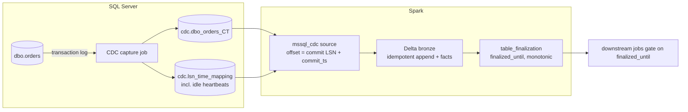

# mssql-cdc-pyspark

A platform-agnostic **PySpark streaming source for SQL Server Change Data Capture**,
built on Spark's Python DataSource V2 API, plus a **completeness signal**
(`finalized_until`) that tells downstream jobs when a period of data is safe to read.

* 100% PySpark: no JVM connector, no platform-specific APIs. Runs on local Spark,
  Databricks classic (DBR 18.2+), and any Spark 4.2+ runtime.
* Offsets are SQL Server commit LSNs, checkpointed by Spark. Supports
  `Trigger.AvailableNow` and per-batch limits (`maxCommitsPerBatch`).
* Arrow end to end: the default driver (`mssql-python`) fetches straight into Arrow
  record batches inside the executors.
* Fails loudly when CDC cleanup purged changes the stream still needed, or re-snapshots on
  its own and records the gap (`on_data_loss="resnapshot"`).

> Status: **v0.1, experimental.** Streaming-engine behaviour (offsets, checkpoints,
> `AvailableNow`, admission control, retention guard) is covered by unit tests
> against a file-backed CDC simulator. SQL Server behaviour is covered by the
> `lab/` checks, which run locally against Docker and in GitHub Actions against
> SQL Server 2022; `tests/integration` runs the source against SQL Server 2022 in Docker
> (testcontainers). See [LAB.md](LAB.md).

## Why

With CDC, "the partition has data" no longer means "the partition is complete":
a commit can reach the lake after its hour has passed. Pinterest solved this for
Flink + Iceberg with *partition finalization*, a watermark inferred from the
event times it observed.

SQL Server CDC can do better, because the source already knows. The capture
process writes changes in commit order, one consistent transaction per scan
cycle, `sys.fn_cdc_get_max_lsn()` is the last LSN it processed, and during
inactivity it writes "dummy" entries (about every 5 minutes on SQL Server 2022) so
that LSN keeps advancing. This project
carries that frontier through the pipeline. Details in [docs/DESIGN.md](docs/DESIGN.md).



## Quick start (local)

Requirements: Docker, [uv](https://docs.astral.sh/uv/), Java 17+.

```bash
cp .env.example .env               # set MSSQL_SA_PASSWORD
docker compose up -d               # SQL Server 2022 + Agent
uv sync                            # .venv with dev tools (Spark, Delta, mssql-python)

uv run python -m lab.workload setup       # database, tables, CDC
uv run python -m lab.workload seed        # Faker data
uv run python examples/local_pipeline.py  # stream -> Delta bronze -> finalized_until
uv run python -m lab.workload stream --duration 60
uv run python examples/local_pipeline.py  # resumes from the checkpoint
```

## Usage

```python
from mssql_cdc import finalization, stream

options = {
    "connectionString": "Server=host,1433;Database=db;UID=u;PWD=p;Encrypt=yes",
    "captureInstance": "dbo_orders",
    "maxCommitsPerBatch": "500",
}
query = stream(spark, options).to_delta(
    "bronze.orders",
    app_id="orders-v1",
    checkpoint="/Volumes/cat/sch/vol/ckpt/orders",
    facts_table="ops.ingestion_facts",
    trigger={"availableNow": True},
    bootstrap=True,
)
query.awaitTermination()

end = finalization.end_offset_from_progress(query.lastProgress)
finalization.advance(spark, "ops.table_finalization", "bronze.orders", end)
```

`stream()` declares the options once: it registers the source, reads with them and writes
through `delta_sink`. With a facts table and a checkpoint that is a local or FUSE path
(such as a Volume), per-partition network and read metrics land in the facts on their own
(`<checkpoint>/_mssql_cdc_metrics`, under the live generation's checkpoint after a
re-snapshot, see below); with a URI checkpoint (`dbfs:/`, `abfss://`), add the
`metricsPath` option. The same files carry the retention headroom: `retention_headroom_hours`
in the facts is how far the stream is ahead of what CDC cleanup has deleted; alert when it
falls, or when facts stop arriving ([ADR 0017](docs/decisions/0017-retention-headroom-in-facts.md)).

They also carry two lags, each with its own alert
([ADR 0020](docs/decisions/0020-capture-and-ingestion-lag-in-facts.md)).
`capture_lag_seconds` is how old the newest commit CDC capture had processed
(`sys.fn_cdc_get_max_lsn`, as `source_max_commit_ts`) was when a partition looked: when it
is high, CDC capture is slow (a log backlog), not the stream; on a quiet database without
the [heartbeat](docs/decisions/0010-heartbeat-for-quiet-databases.md) it sits up to about 5
minutes. It cannot show a stopped capture (capture job or SQL Server Agent down):
`max_lsn` freezes, no batch runs and no facts row is written, so the last value stays
small and the only sign is facts no longer arriving, which a quiet table also causes. For a
capture lag that updates on every trigger, use `now - latestOffset.commit_ts` from the
source's `lastProgress` (`reportLatestOffset` reports `max_lsn` and its commit time).
`ingestion_lag_seconds` is how far the batch's last change (`max_commit_ts`) is
behind that commit: when it is high, the stream is behind what CDC has captured. What it
gains, `retention_headroom_hours` loses, so alert on the lag before the headroom runs out.

`bootstrap=True` loads the whole table, not only what CDC retention still holds: the first
run appends a snapshot of the source table to the target (operation 0, stamped with the
`max_lsn` recorded before the read) and starts the checkpoint from that LSN. Later runs find
the snapshot and read nothing again. A MERGE downstream that keeps the latest image per key
absorbs the overlap between snapshot and stream
([ADR 0016](docs/decisions/0016-bootstrap-snapshot-at-a-recorded-lsn.md)). With a facts
table, the snapshot also gets a facts row with `event = 'bootstrap'` (micro-batch rows have
`event` NULL).
`stream(spark, options).snapshot(target)` does the snapshot alone and returns the offset;
`spark.read.format("mssql_cdc_snapshot")` reads it for another sink.

The same pipeline by hand, for another sink or more control:

```python
from mssql_cdc import register, finalization
from mssql_cdc.sink import delta_sink

register(spark)

query = (
    spark.readStream.format("mssql_cdc")
    .option("connectionString", "Server=host,1433;Database=db;UID=u;PWD=p;Encrypt=yes")
    .option("captureInstance", "dbo_orders")
    .option("maxCommitsPerBatch", "500")
    .load()
    .writeStream.foreachBatch(
        delta_sink("bronze.orders", app_id="orders-v1", facts_table="ops.ingestion_facts")
    )
    .option("checkpointLocation", "/checkpoints/orders")
    .trigger(availableNow=True)
    .start()
)
query.awaitTermination()

end = finalization.end_offset_from_progress(query.lastProgress)
finalization.advance(spark, "ops.table_finalization", "bronze.orders", end)
```

### Recovering from data loss

CDC cleanup deletes changes by age, read or not. A stream stopped or behind for longer than
the retention (3 days by default) finds its next changes gone and stops with `DataLossError`.
With `on_data_loss="resnapshot"`, `to_delta` checks the checkpoint before it starts and, when
the next changes are purged, takes a new snapshot and continues from it in a new generation:
Spark checkpoint `<checkpoint>/_generations/<n>` and `app_id` `<app_id>.g<n>`, all under the
checkpoint you passed.

```python
query = stream(spark, options).to_delta(
    "bronze.orders",
    app_id="orders-v1",
    checkpoint="/Volumes/cat/sch/vol/ckpt/orders",
    facts_table="ops.ingestion_facts",
    trigger={"availableNow": True},
    bootstrap=True,
    on_data_loss="resnapshot",
    resnapshot_interval_days=7,
)
```

The changes between the last offset read and the retention watermark are lost for good. The
facts get a row with `event = 'resnapshot'` and the gap in `lost_from_ts` and `lost_to_ts`;
downstream should then rebuild from the newest snapshot: the highest `_start_lsn` of the
target's `_operation = 0` rows or of the facts' event rows (`max_lsn`), whichever is higher,
because a snapshot of an empty table writes no rows. A purge during a run still fails that
query, and the next run recovers. A second loss within `resnapshot_interval_days` (keep it
above the retention) raises `DataLossError` instead: the stream cannot keep up, and a person
has to decide; so does a re-snapshot whose own LSN was purged before the read ended. Needs a
facts table and a checkpoint path that Python and Spark resolve to the same directory (local,
or a Volume; not a URI or `/dbfs/`); run one job per stream
([ADR 0018](docs/decisions/0018-automatic-resnapshot-after-data-loss.md)).

### Applying changes to a current-state table

`apply_changes` keeps a silver table equal to the source table, one row per key, from the
bronze change log. Run it after the stream, in the same job or another:

```python
from mssql_cdc import apply_changes

result = apply_changes(
    spark,
    "bronze.orders",  # as passed to to_delta and advance
    "silver.orders",
    "dbo_orders",
    ["order_id"],  # or omit and pass options=... to read the key
    control_table="ops.table_finalization",
    facts_table="ops.ingestion_facts",
)
# {"rebuilt": False, "applied_lsn": "0x...", "finalized_until": datetime(...)}
```

Each call applies what bronze holds beyond the last one: the latest image per key by
`(_start_lsn, _command_id, _seqval, _operation)`, where operation 3 (the row before an
update) is ignored, 1 deletes the row, and 0 (snapshot), 2 and 4 upsert it. Silver has the
captured columns plus `_start_lsn` and `_commit_ts` of each row's current image; deleted
rows are removed. Without `keys`, pass the stream's `options` and the key comes from the
capture instance's unique index.

The position is `applied_lsn` in the control table, written after the MERGE: a rerun, or a
call after a crash, applies nothing twice and resurrects nothing. When bronze holds a newer
snapshot than the one silver was last rebuilt from (`snapshot_lsn`; a bootstrap, or a
re-snapshot after data loss), silver is rebuilt from it, so rows deleted during a purged gap
disappear; pass `facts_table` so that the re-snapshot of an emptied table, which writes no
rows, is seen too. The bronze table must hold one capture instance, as its verdict already
does, and until the stream has created it a call does nothing. Silver's
`finalized_until` is the bronze verdict read before the call read bronze, so it never claims
more than was applied: gate consumers with
`finalization.is_final(spark, "ops.table_finalization", "silver.orders", period_end)`.
One call per silver table at a time
([ADR 0019](docs/decisions/0019-silver-helper-applies-the-change-log.md)).

### Options

| Option | Default | Meaning |
|---|---|---|
| `captureInstance` | required | e.g. `dbo_orders` |
| `columns` | inferred | DDL of the captured columns to read. Inferred with `sys.sp_cdc_get_captured_columns` when omitted; required for `backend=fake` |
| `connectionString` | required | `mssql-python` / ODBC 18 connection string |
| `backend` | `mssql-python` | `mssql-python`, `arrow-odbc`, or `fake` (tests; reads `fakePath`) |
| `connectTimeout` | `30` | login timeout in seconds (mssql-python backend) |
| `startingLsn` | `earliest` | `earliest`, `latest`, or an LSN (`0x...`), treated as already processed. `to_delta(bootstrap=True)` sets it to the snapshot's LSN; after a re-snapshot (generation `n > 0`) `to_delta` ignores it and starts at that snapshot |
| `maxCommitsPerBatch` | unlimited | commits (from `cdc.lsn_time_mapping`) per micro-batch |
| `numPartitions` | `auto` | split each batch into commit-aligned LSN ranges (a snapshot: uniform ranges of a single integer key, else `NTILE` tiles of the rows by the whole key, composite or not), one connection each. `auto`: the cores of the session that called `register()` (`defaultParallelism`), else (Spark Connect, or no `register()`) the CPU count of the node that plans; set a number to cap the load on the source |
| `sourceTimeZone` | `auto` | Windows time zone name of the server clock (e.g. `E. South America Standard Time`), used to convert commit times to UTC. `auto` reads `CURRENT_TIMEZONE_ID()` (SQL Server 2022+, Azure SQL); on older versions it applies the server's current UTC offset (`SYSDATETIMEOFFSET()`), exact for zones without daylight saving; elsewhere, set the zone name |
| `failOnDataLoss` | `true` | raise when CDC cleanup purged the next range |
| `includeCommandId` | `true` | read `__$command_id` (ordering within a transaction) |
| `arrowBatchSize` | `10000` | rows per Arrow batch fetched from the driver |
| `snapshotLsn` | `max_lsn` before the read | `mssql_cdc_snapshot` only: the LSN stamped on the snapshot rows |
| `metricsPath` | none (`stream()`: `_mssql_cdc_metrics` under the live generation's checkpoint for local/FUSE checkpoints, see [Generations](docs/ARCHITECTURE.md#generations-to_delta)) | directory (local, or FUSE such as a Volume) where each partition that read rows leaves its round trip, read time, MB, network wait, retention watermark and capture lag for `delta_sink(metrics_path=...)` to fold into the facts |

### Output schema

Captured columns (inferred, or as given in `columns`), plus:

| Column | Type | Source |
|---|---|---|
| `_capture_instance` | string | option |
| `_start_lsn` | string | `__$start_lsn`, commit LSN as `0x` + 20 hex |
| `_seqval` | string | `__$seqval` |
| `_operation` | int | 1 delete, 2 insert, 3 update (before), 4 update (after); 0 snapshot row |
| `_command_id` | int | `__$command_id` |
| `_commit_ts` | timestamp_ntz | `cdc.lsn_time_mapping.tran_end_time`, in UTC |

Order changes with `(_start_lsn, _command_id, _seqval, _operation)`. Snapshot rows have
`_seqval` and `_command_id` NULL and share one `_start_lsn`, below every change read after them.

### Permissions

A `db_owner` needs nothing else. A least-privilege login needs what the CDC query
functions need, plus one grant per capture instance, because the reader reads the change
table directly (see [ADR 0009](docs/decisions/0009-read-change-tables-directly.md)):

```sql
GRANT SELECT ON dbo.orders TO cdc_reader;           -- the captured source columns
GRANT SELECT ON cdc.[dbo_orders_CT] TO cdc_reader;  -- the change table
-- and, if the capture instance has a gating role:
ALTER ROLE <gating_role> ADD MEMBER cdc_reader;
```

### Completeness semantics

`finalized_until = truncate(end.commit_ts, "hour")`, advanced only after the batch
is committed and never moved backwards. **Every period strictly before
`finalized_until` is complete** in the target: no source commit at or before that
time can still arrive. Use `finalization.is_final(spark, control, table, period_end)`
in consumers, or query the control table directly.

On a quiet database the verdict trails real time by up to ~5 minutes, the interval of
SQL Server's idle entries. [`sql/heartbeat.sql`](sql/heartbeat.sql) (a one-row
CDC-tracked table updated every 10 seconds by an Agent job) brings that down to about
10 seconds; see [ADR 0010](docs/decisions/0010-heartbeat-for-quiet-databases.md).

## Drivers

`mssql-python` (default) is pip-only and fetches natively into Arrow.
`arrow-odbc` is supported where msodbcsql18 is already installed. The survey
behind this choice is in [docs/CONNECTORS.md](docs/CONNECTORS.md).

## Platforms

* **Local**: `mssql_cdc.spark.get_spark()` builds a session with Delta.
* **Databricks classic**: see [docs/DATABRICKS.md](docs/DATABRICKS.md) and
  [examples/databricks_notebook.py](examples/databricks_notebook.py).
* **Others**: any Spark 4.2+ with Python workers and network access to SQL Server.

## Development

```bash
uv sync
uv run pytest -q                # engine tests, no SQL Server needed
```

See [docs/DEVELOPMENT.md](docs/DEVELOPMENT.md) (setup for Linux and Windows),
[docs/ARCHITECTURE.md](docs/ARCHITECTURE.md), [docs/ROADMAP.md](docs/ROADMAP.md),
the decision records in [docs/decisions/](docs/decisions/), and
[CONTRIBUTING.md](CONTRIBUTING.md).

## License

MIT
