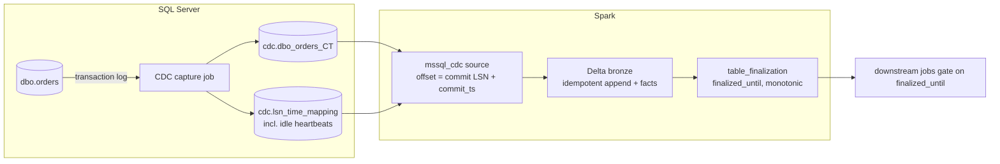

# mssql-cdc-pyspark

A platform-agnostic **PySpark streaming source for SQL Server Change Data Capture**,
built on Spark's Python DataSource V2 API, plus a **completeness signal**
(`finalized_until`) that tells downstream jobs when a period of data is safe to read.

* 100% PySpark: no JVM connector, no platform-specific APIs. Tested on local Spark 4.2 and
  on Databricks classic compute (DBR 18.2, dedicated access mode); other Spark 4.2+ runtimes
  are untested. The metrics need `metricsPath` on a local or FUSE path every node sees, such
  as a Unity Catalog Volume. Not supported yet: Databricks serverless, which refuses the
  DataFrame cache API the sink calls on every batch and `processingTime` triggers (it would
  need at least `trigger={"availableNow": True}`), and a `metricsPath` on an object store
  (`s3://`, `abfss://`...), which `to_delta` refuses. Without a shared path (EMR and
  Dataproc have none by default) the stream runs, but the facts' metric columns stay NULL
  and schema change events do not reach them.
* Offsets are SQL Server commit LSNs, checkpointed by Spark. Supports
  `Trigger.AvailableNow` and per-batch limits (`maxCommitsPerBatch`).
* Arrow end to end: the default driver (`mssql-python`) fetches straight into Arrow
  record batches inside the executors.
* Fails loudly when CDC cleanup purged changes the stream still needed, or re-snapshots on
  its own and records the gap (`on_data_loss="resnapshot"`).

**Documentation: <https://emanuel-luis.github.io/mssql-cdc-pyspark/>**

> Status: **experimental** (0.x; the version is in `pyproject.toml`). Streaming-engine behaviour (offsets, checkpoints,
> `AvailableNow`, admission control, retention guard) is covered by unit tests
> against a file-backed CDC simulator. SQL Server behaviour is covered by the
> `lab/` checks, which run locally against Docker and in GitHub Actions against
> SQL Server 2022; `tests/integration` runs the source against SQL Server 2022 in Docker
> (testcontainers). See [LAB.md](https://github.com/emanuel-luis/mssql-cdc-pyspark/blob/main/LAB.md).

## Why

With CDC, "the partition has data" no longer means "the partition is complete":
a commit can reach the lake after its hour has passed. Pinterest solved this for
Flink + Iceberg with *partition finalization*, a watermark inferred from the
event times it observed.

SQL Server CDC can do better, because the source already knows. The capture
process writes changes in commit order, one consistent transaction per scan
cycle, `sys.fn_cdc_get_max_lsn()` is the last LSN it processed, and during
inactivity it writes "dummy" entries (about every 5 minutes on SQL Server 2022) so
that LSN keeps advancing. This project
carries that frontier through the pipeline. Details in the
[design notes](https://emanuel-luis.github.io/mssql-cdc-pyspark/DESIGN/).



## Install

On a Spark platform (Databricks, EMR, Dataproc, Fabric), which ships its own PySpark:

```bash
pip install mssql-cdc-pyspark
```

Locally, with PySpark and Delta: `pip install "mssql-cdc-pyspark[spark]"`. On Linux the
default driver needs system libraries that pip does not install; see
[Installation](https://emanuel-luis.github.io/mssql-cdc-pyspark/getting-started/installation/).

## Quick start (local)

Requirements: Docker, [uv](https://docs.astral.sh/uv/), Java 17 (21 is untested); on Linux, the
driver's system libraries above.

```bash
cp .env.example .env               # set MSSQL_SA_PASSWORD
docker compose up -d               # SQL Server 2022 + Agent
uv sync                            # .venv with dev tools (Spark, Delta, mssql-python)

uv run python -m lab.workload setup       # database, tables, CDC
uv run python -m lab.workload seed        # Faker data
uv run python examples/local_pipeline.py  # stream -> Delta bronze -> finalized_until
uv run python -m lab.workload stream --duration 60
uv run python examples/local_pipeline.py  # resumes from the checkpoint
```

The [Quickstart](https://emanuel-luis.github.io/mssql-cdc-pyspark/getting-started/quickstart/)
walks through it.

## Usage

```python
from mssql_cdc import finalization, stream

options = {
    "connectionString": "Server=host,1433;Database=db;UID=u;PWD=p;Encrypt=yes",
    "captureInstance": "dbo_orders",
    "maxCommitsPerBatch": "500",
}
query = stream(spark, options).to_delta(
    "bronze.orders",
    app_id="orders-v1",
    checkpoint="/Volumes/cat/sch/vol/ckpt/orders",
    facts_table="ops.ingestion_facts",
    trigger={"availableNow": True},
    bootstrap=True,
)
query.awaitTermination()

end = finalization.end_offset_from_progress(query.lastProgress)
finalization.advance(spark, "ops.table_finalization", "bronze.orders", end)
```

The rest is in the documentation:

* Guides: [streaming into Delta](https://emanuel-luis.github.io/mssql-cdc-pyspark/guides/streaming/),
  [bootstrap](https://emanuel-luis.github.io/mssql-cdc-pyspark/guides/bootstrap/),
  [data loss and re-snapshots](https://emanuel-luis.github.io/mssql-cdc-pyspark/guides/data-loss/),
  [silver tables](https://emanuel-luis.github.io/mssql-cdc-pyspark/guides/silver/),
  [finalization](https://emanuel-luis.github.io/mssql-cdc-pyspark/guides/finalization/),
  [monitoring](https://emanuel-luis.github.io/mssql-cdc-pyspark/guides/monitoring/),
  [permissions](https://emanuel-luis.github.io/mssql-cdc-pyspark/guides/permissions/),
  [schema changes](https://emanuel-luis.github.io/mssql-cdc-pyspark/guides/schema-changes/),
  [many tables](https://emanuel-luis.github.io/mssql-cdc-pyspark/guides/many-tables/)
  and [Databricks](https://emanuel-luis.github.io/mssql-cdc-pyspark/DATABRICKS/).
* Reference: [options](https://emanuel-luis.github.io/mssql-cdc-pyspark/reference/options/),
  [output schema](https://emanuel-luis.github.io/mssql-cdc-pyspark/reference/output-schema/),
  [tables](https://emanuel-luis.github.io/mssql-cdc-pyspark/reference/tables/) and the
  [Python API](https://emanuel-luis.github.io/mssql-cdc-pyspark/reference/api/).

## Compatibility

Within 0.x, a minor release may break the Python API (each break listed under "Breaking" in
[CHANGELOG.md](https://github.com/emanuel-luis/mssql-cdc-pyspark/blob/main/CHANGELOG.md), with what to change) and a patch only fixes. The state a
stream leaves behind never breaks without a migration path: the offsets in its checkpoints,
the checkpoint layout, and the schemas of the tables it writes, which change only through
migrations that run on their own. Every release's "State compatibility" line says what it
does to that state. The public API is what the documentation's reference documents (the
Python API, the options and the output schema); everything else may change in any release
([ADR 0021](https://emanuel-luis.github.io/mssql-cdc-pyspark/decisions/0021-compatibility-policy-for-0x/)).

## Development

```bash
uv sync
uv run pytest -q                # engine tests, no SQL Server needed
```

See [Development](https://emanuel-luis.github.io/mssql-cdc-pyspark/DEVELOPMENT/) (setup for Linux and Windows),
[Architecture](https://emanuel-luis.github.io/mssql-cdc-pyspark/ARCHITECTURE/), the
[roadmap](https://emanuel-luis.github.io/mssql-cdc-pyspark/ROADMAP/),
the [decision records](https://emanuel-luis.github.io/mssql-cdc-pyspark/decisions/), and
[CONTRIBUTING.md](https://github.com/emanuel-luis/mssql-cdc-pyspark/blob/main/CONTRIBUTING.md).

## License

MIT. The default backend's dependency `mssql-python` pulls in `mssql-python-odbc`, which
holds Microsoft's ODBC Driver 18 binaries under Microsoft's own license. For a
license-sensitive install, leave it out (`pip install --no-deps mssql-cdc-pyspark`, then
`pip install pyarrow arrow-odbc`) and use `backend=arrow-odbc` with a driver installed
separately under its EULA
([Installation](https://emanuel-luis.github.io/mssql-cdc-pyspark/getting-started/installation/#the-driver)).
