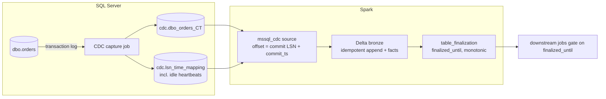

# mssql-cdc-pyspark

A platform-agnostic **PySpark streaming source for SQL Server Change Data Capture**,
built on Spark's Python DataSource V2 API, plus a **completeness signal**
(`finalized_until`) that tells downstream jobs when a period of data is safe to read.

* 100% PySpark: no JVM connector, no platform-specific APIs. Runs on local Spark,
  Databricks classic, and any Spark 4.2+ runtime.
* Offsets are SQL Server commit LSNs, checkpointed by Spark. Supports
  `Trigger.AvailableNow` and per-batch limits (`maxCommitsPerBatch`).
* Arrow end to end: the default driver (`mssql-python`) fetches straight into Arrow
  record batches inside the executors.
* Fails loudly when CDC cleanup purged changes the stream still needed.

> Status: **v0.1, experimental.** Streaming-engine behaviour (offsets, checkpoints,
> `AvailableNow`, admission control, retention guard) is covered by unit tests
> against a file-backed CDC simulator. SQL Server behaviour is covered by the
> `lab/` checks, which run locally against Docker and in GitHub Actions against
> SQL Server 2022. See [LAB.md](LAB.md).

## Why

With CDC, "the partition has data" no longer means "the partition is complete":
a commit can reach the lake after its hour has passed. Pinterest solved this for
Flink + Iceberg with *partition finalization*, a watermark inferred from the
event times it observed.

SQL Server CDC can do better, because the source already knows. The capture
process writes changes in commit order, one consistent transaction per scan
cycle, `sys.fn_cdc_get_max_lsn()` is the last LSN it processed, and during
inactivity it writes "dummy" entries (about every 5 minutes on SQL Server 2022) so
that LSN keeps advancing. This project
carries that frontier through the pipeline. Details in [docs/DESIGN.md](docs/DESIGN.md).



## Quick start (local)

Requirements: Docker, [uv](https://docs.astral.sh/uv/), Java 17+.

```bash
cp .env.example .env               # set MSSQL_SA_PASSWORD
docker compose up -d               # SQL Server 2022 + Agent
uv sync                            # .venv with dev tools (Spark, Delta, mssql-python)

uv run python -m lab.workload setup       # database, tables, CDC
uv run python -m lab.workload seed        # Faker data
uv run python examples/local_pipeline.py  # stream -> Delta bronze -> finalized_until
uv run python -m lab.workload stream --duration 60
uv run python examples/local_pipeline.py  # resumes from the checkpoint
```

## Usage

```python
from mssql_cdc import register, finalization
from mssql_cdc.sink import delta_sink

register(spark)

query = (
    spark.readStream.format("mssql_cdc")
    .option("connectionString", "Server=host,1433;Database=db;UID=u;PWD=p;Encrypt=yes")
    .option("captureInstance", "dbo_orders")
    .option("maxCommitsPerBatch", "500")
    .load()
    .writeStream.foreachBatch(delta_sink("bronze.orders", app_id="orders-v1",
                                         facts_table="ops.ingestion_facts"))
    .option("checkpointLocation", "/checkpoints/orders")
    .trigger(availableNow=True)
    .start()
)
query.awaitTermination()

end = finalization.end_offset_from_progress(query.lastProgress)
finalization.advance(spark, "ops.table_finalization", "bronze.orders", end)
```

### Options

| Option | Default | Meaning |
|---|---|---|
| `captureInstance` | required | e.g. `dbo_orders` |
| `columns` | inferred | DDL of the captured columns to read. Inferred with `sys.sp_cdc_get_captured_columns` when omitted; required for `backend=fake` |
| `connectionString` | required | `mssql-python` / ODBC 18 connection string |
| `backend` | `mssql-python` | `mssql-python`, `arrow-odbc`, or `fake` (tests) |
| `startingLsn` | `earliest` | `earliest`, `latest`, or an LSN (`0x...`), treated as already processed |
| `maxCommitsPerBatch` | unlimited | commits (from `cdc.lsn_time_mapping`) per micro-batch |
| `numPartitions` | `1` | split each batch into commit-aligned LSN ranges |
| `sourceTimeZone` | `auto` | Windows time zone name of the server clock (e.g. `E. South America Standard Time`), used to convert commit times to UTC. `auto` reads `CURRENT_TIMEZONE_ID()` (SQL Server 2022+, Azure SQL); older versions must set it |
| `failOnDataLoss` | `true` | raise when CDC cleanup purged the next range |
| `includeCommandId` | `true` | read `__$command_id` (ordering within a transaction) |
| `arrowBatchSize` | `10000` | rows per Arrow batch fetched from the driver |

### Output schema

Captured columns (inferred, or as given in `columns`), plus:

| Column | Type | Source |
|---|---|---|
| `_capture_instance` | string | option |
| `_start_lsn` | string | `__$start_lsn`, commit LSN as `0x` + 20 hex |
| `_seqval` | string | `__$seqval` |
| `_operation` | int | 1 delete, 2 insert, 3 update (before), 4 update (after) |
| `_command_id` | int | `__$command_id` |
| `_commit_ts` | timestamp_ntz | `cdc.lsn_time_mapping.tran_end_time`, in UTC |

Order changes with `(_start_lsn, _command_id, _seqval, _operation)`.

### Permissions

A `db_owner` needs nothing else. A least-privilege login needs what the CDC query
functions need, plus one grant per capture instance, because the reader reads the change
table directly (see [ADR 0009](docs/decisions/0009-read-change-tables-directly.md)):

```sql
GRANT SELECT ON dbo.orders TO cdc_reader;           -- the captured source columns
GRANT SELECT ON cdc.[dbo_orders_CT] TO cdc_reader;  -- the change table
-- and, if the capture instance has a gating role:
ALTER ROLE <gating_role> ADD MEMBER cdc_reader;
```

### Completeness semantics

`finalized_until = truncate(end.commit_ts, "hour")`, advanced only after the batch
is committed and never moved backwards. **Every period strictly before
`finalized_until` is complete** in the target: no source commit at or before that
time can still arrive. Use `finalization.is_final(spark, control, table, period_end)`
in consumers, or query the control table directly.

On a quiet database the verdict trails real time by up to ~5 minutes, the interval of
SQL Server's idle entries. [`sql/heartbeat.sql`](sql/heartbeat.sql) (a one-row
CDC-tracked table updated every 10 seconds by an Agent job) brings that down to about
10 seconds; see [ADR 0010](docs/decisions/0010-heartbeat-for-quiet-databases.md).

## Drivers

`mssql-python` (default) is pip-only and fetches natively into Arrow.
`arrow-odbc` is supported where msodbcsql18 is already installed. The survey
behind this choice is in [docs/CONNECTORS.md](docs/CONNECTORS.md).

## Platforms

* **Local**: `mssql_cdc.spark.get_spark()` builds a session with Delta.
* **Databricks classic**: see [docs/DATABRICKS.md](docs/DATABRICKS.md) and
  [examples/databricks_notebook.py](examples/databricks_notebook.py).
* **Others**: any Spark 4.2+ with Python workers and network access to SQL Server.

## Development

```bash
uv sync
uv run pytest -q                # engine tests, no SQL Server needed
```

See [docs/DEVELOPMENT.md](docs/DEVELOPMENT.md) (setup for Linux and Windows),
[docs/ARCHITECTURE.md](docs/ARCHITECTURE.md), [docs/ROADMAP.md](docs/ROADMAP.md),
the decision records in [docs/decisions/](docs/decisions/), and
[CONTRIBUTING.md](CONTRIBUTING.md).

## License

MIT
