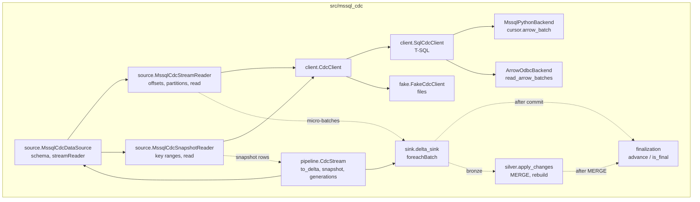
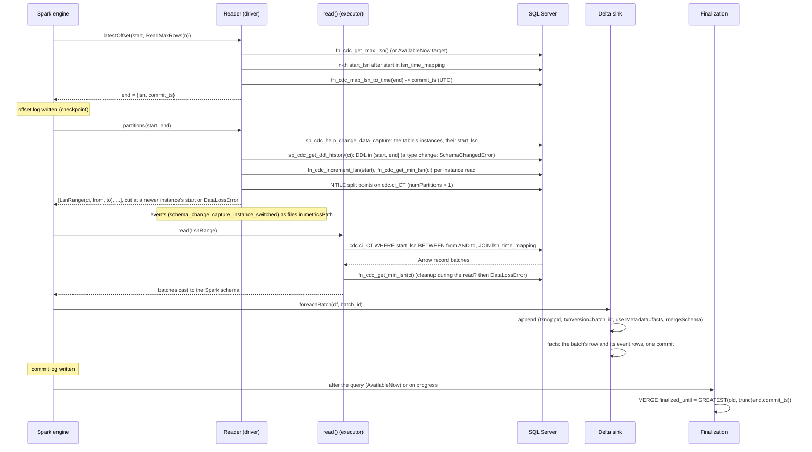

# Architecture

## Components



* **Source**: Spark Python DataSource V2 (`pyspark.sql.datasource`). One stream per
  source table: its capture instance, and the newer one it switches to (ADR 0023).
  `mssql_cdc_snapshot` is its batch sibling: the tracked table's current rows in the same
  schema, stamped with one LSN, for the initial load (ADR 0016).
* **Client**: the only code that knows T-SQL. The reader depends on the `CdcClient`
  interface, so the fake can replace SQL Server in tests.
* **Backends**: turn a query into Arrow record batches. Interchangeable because every
  LSN is a hex string on the wire (invariant 6 in `CLAUDE.md`).
* **Sink**: an optional, Delta-specific `foreachBatch` writer. The source works with any
  sink.
* **Finalization**: a control table with one row per target table.
* **Silver**: `apply_changes` reads bronze (and the facts, for re-snapshots) and MERGEs the
  latest image per key into a current-state table; its position and verdict are its row in
  the control table ([ADR 0019](decisions/0019-silver-helper-applies-the-change-log.md)).

## Where code runs

| Method | Process | Notes |
|---|---|---|
| `DataSource.schema()` | driver-side Python worker | returns a DDL string; no JVM access |
| `initialOffset`, `latestOffset`, `getDefaultReadLimit`, `prepareForTriggerAvailableNow`, `reportLatestOffset`, `partitions`, `commit` | one long-lived driver-side Python worker per query | may keep state (`_target`, cached client) |
| `read(partition)` | executor Python workers, one call per partition | stateless; opens its own connection; the reader is pickled without `_client` |
| snapshot `partitions()` | driver-side Python worker, once per read | records the snapshot LSN unless `snapshotLsn` is set; each `KeyRange` carries the LSN, commit time, table and key bounds, so `read` needs no planning state |

## One micro-batch



## Offsets and the checkpoint

```json
{"lsn": "0x0000002A000001F00003", "commit_ts": "2026-09-28T14:03:12.117"}
```

* `lsn`: last processed commit LSN. The initial offset for `startingLsn=earliest` is
  `fn_cdc_decrement_lsn(min_lsn)`, so the first read starts at `min_lsn`.
* `commit_ts`: commit time of `lsn` in UTC. It is stored even when the batch has no
  rows, because `end` can be an idle "dummy" entry. This is what lets finalization
  advance on quiet tables.
* Replays: Spark re-runs an uncommitted batch with the same `(start, end)`. `read()` is
  deterministic for a range as long as CDC cleanup has not purged it; if it has, the
  guard fails the query.

### A second capture instance

A table can have two capture instances, the newer one usually capturing a column the older
does not ([ADR 0023](decisions/0023-schema-changes-and-capture-instance-switching.md)). The
newer one's `start_lsn` S is the commit LSN of its enable, and from S on every commit is in
both. `partitions()` lists the table's instances on every planning and cuts the batch at S:

```
start                S - 1 | S                        end
  |------ older: cdc.dbo_orders_CT ------|------ newer: cdc.dbo_orders_v2_CT ------|
```

Offsets stay database-wide LSNs, so the checkpoint needs nothing new, and a replay cuts at
the same place. Each range reads its own instance's columns, NULL for the ones it lacks;
`load()` infers the union of both. The first batch that reads the newer instance leaves a
`capture_instance_switched` event for the facts: from then on the DBA can disable the older
one (`sql/switch_capture_instance.sql`). DDL inside a batch leaves a `schema_change` event;
a changed type fails the batch before it reads anything (`SchemaChangedError`).

### Generations (`to_delta`)

`to_delta` reads `<checkpoint>/_mssql_cdc_generation.json` on every call to find the live
generation. Without the file it is generation 0: the checkpoint and `app_id` as given.

```
<checkpoint>/
  offsets/ commits/ metadata ...   generation 0 (Spark's files)
  _mssql_cdc_metrics/              generation 0 metrics (default metricsPath)
  _mssql_cdc_generation.json       {"generation": n, "snapshot_lsn", "commit_ts", "at"},
                                   plus "recovering" and "failed_at" while a recovery is open
  _generations/<n>/                generation n: Spark checkpoint and metrics, app_id <app_id>.g<n>
```

With `on_data_loss="resnapshot"`, before starting the query it takes the last processed
offset from the live checkpoint (line 3 of `offsets/<n>` for the highest committed `n`,
Spark's offset log format `v1`) and, when `max_lsn` is past it, applies the driver guard's
test. When the next range is purged it records that offset as `recovering`, snapshots the
target, records a `'resnapshot'` facts row, writes the state file for `n + 1` (atomically;
the commit point) and starts generation `n + 1` from the snapshot's LSN. At most one
automatic re-snapshot, or failed one, per `resnapshot_interval_days`
([ADR 0018](decisions/0018-automatic-resnapshot-after-data-loss.md)).

## Output schema

Metadata columns `_capture_instance, _start_lsn, _seqval, _operation, _command_id,
_commit_ts`, then the captured columns. The ordering key for applying changes is
`(_start_lsn, _command_id, _seqval, _operation)`. `_command_id` is numbered per capture
instance, but all rows of one `_start_lsn` come from one instance, so the key holds across a
switch; `(_start_lsn, _seqval, _operation)` identifies a change across instances.
`_capture_instance` is the instance the row was read from. Snapshot rows have
`_operation = 0`, the snapshot's LSN as `_start_lsn` and NULL `_seqval` and `_command_id`.

Captured columns come from the `columns` option (DDL) or, when it is omitted, from CDC
metadata at `load()` time on the driver: `sys.sp_cdc_get_captured_columns`, sorted by
`column_ordinal` (`SqlCdcClient.captured_columns`), for every capture instance of the table,
joined by name, older instance first. It needs only the permissions of the CDC query
functions. Default type mapping:

| SQL Server | Spark |
|---|---|
| `bit` | `BOOLEAN` |
| `tinyint`, `smallint` | `SMALLINT` |
| `int` / `bigint` | `INT` / `BIGINT` |
| `real` / `float` | `FLOAT` / `DOUBLE` |
| `decimal(p,s)`, `numeric(p,s)` | `DECIMAL(p,s)` |
| `money` / `smallmoney` | `DECIMAL(19,4)` / `DECIMAL(10,4)` |
| `date` | `DATE` |
| `datetime`, `datetime2`, `smalldatetime` | `TIMESTAMP_NTZ` |
| `datetimeoffset` | `TIMESTAMP` |
| `char`, `varchar`, `nchar`, `nvarchar`, `text`, `ntext`, `xml`, `uniqueidentifier`, `time` | `STRING` |
| `binary`, `varbinary`, `image`, `rowversion` | `BINARY` |

Alias types map through their base type. Anything else (`sql_variant`, `geography`,
`geometry`, `hierarchyid`) fails at `load()` with a message to pass `columns`. The fake
backend has no type metadata and always needs `columns`.

## Tables written by the sink, finalization and silver

| Table | Grain | Written by | Notes |
|---|---|---|---|
| bronze (e.g. `bronze_orders`) | one row per change | `delta_sink` | append-only; `_batch_id` added; commit `userMetadata` holds the batch facts; appends with `mergeSchema`, so a column a newer capture instance captures joins the table ([ADR 0023](decisions/0023-schema-changes-and-capture-instance-switching.md)) |
| facts (optional) | one row per micro-batch, including batches that read no change rows (`rows = 0`, no target commit: the offset moved past idle entries or other tables' commits), one per snapshot `to_delta` takes (bootstrap or re-snapshot), and one per schema change or capture instance switch a batch read past | `delta_sink`, `write_event` | snapshot rows have `event` `'bootstrap'` or `'resnapshot'` (NULL for batches), no `batch_id`, and on a re-snapshot the purged gap in `lost_from_ts`/`lost_to_ts` ([ADR 0018](decisions/0018-automatic-resnapshot-after-data-loss.md)); `'schema_change'` and `'capture_instance_switched'` rows have the batch's `batch_id`, `rows = 0`, the change's LSN and what changed in `detail`, written in one commit with the batch's row ([ADR 0023](decisions/0023-schema-changes-and-capture-instance-switching.md)): rebuild only from `'bootstrap'` and `'resnapshot'` rows; durable copy of the facts (Delta checkpoints drop `commitInfo`), plus `started_at`/`duration_ms` (source read + target write), `written_at`, and optional network and read metrics (`source_rtt_ms`, `read_seconds`, `read_mb`, `network_wait_ms`; [ADR 0014](decisions/0014-network-and-read-metrics-in-facts.md)), the batch's end offset (`end_lsn`, `end_commit_ts`), and, measured from it, the retention headroom (`retention_watermark_ts`, `retention_headroom_hours`; [ADR 0017](decisions/0017-retention-headroom-in-facts.md)) and the ingestion lag, with the capture lag (`source_max_commit_ts`, `capture_lag_seconds`, `ingestion_lag_seconds`; [ADR 0020](decisions/0020-capture-and-ingestion-lag-in-facts.md)) |
| `table_finalization` | one row per target table | `finalization.advance`, `apply_changes` | `finalized_until`, `end_lsn`, `end_commit_ts`, `updated_at`; `applied_lsn` and `snapshot_lsn` for silver tables: how far bronze is applied, and the snapshot last rebuilt from |
| silver (e.g. `silver_orders`) | one row per source key | `apply_changes` | current state: captured columns plus `_start_lsn` and `_commit_ts` of the row's image; deletes remove rows; rebuilt from the newest snapshot after a re-snapshot ([ADR 0019](decisions/0019-silver-helper-applies-the-change-log.md)) |

All four are created on first use with `DeltaTable.createIfNotExists`: explicit types, and a
comment on the table and on every control, facts, bronze and silver metadata column
(`DESCRIBE TABLE` shows them), and stamped with the table property
`mssql_cdc.schema_version`. Existing tables get the schema migrations of their kind that
they have not had yet ([ADR 0012](decisions/0012-delta-tables-through-the-deltatable-api.md),
[ADR 0013](decisions/0013-schema-migrations-per-table-kind.md)).

## Extension points

* **New backend**: subclass `client.Backend` (`batches`, optionally `scalar`) and add
  it to `make_client`.
* **Other sinks**: the source is sink-agnostic; any `writeStream` target works.
  Idempotency and facts are then the sink's job.
* **Continuous mode**: call `finalization.advance` from a `StreamingQueryListener`
  (roadmap), or from a separate job reading the checkpoint's committed offsets.
