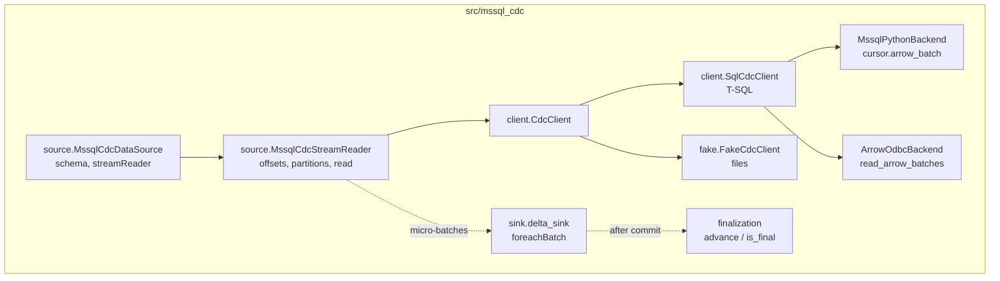
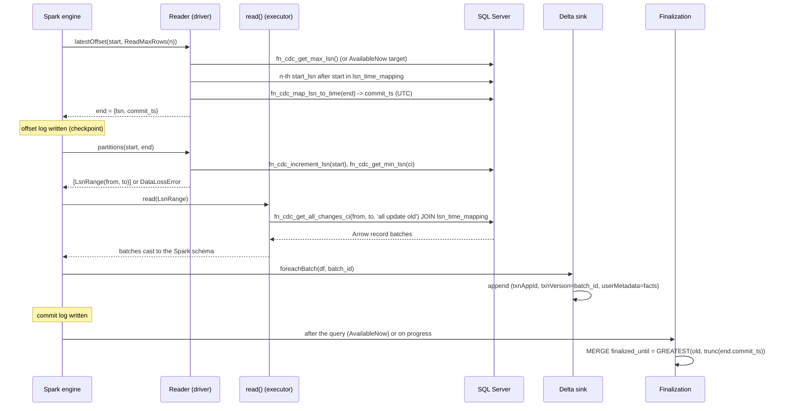

# Architecture

## Components



* **Source**: Spark Python DataSource V2 (`pyspark.sql.datasource`). One stream per
  capture instance.
* **Client**: the only code that knows T-SQL. The reader depends on the `CdcClient`
  interface, so the fake can replace SQL Server in tests.
* **Backends**: turn a query into Arrow record batches. Interchangeable because every
  LSN is a hex string on the wire (invariant 6 in `CLAUDE.md`).
* **Sink**: an optional, Delta-specific `foreachBatch` writer. The source works with any
  sink.
* **Finalization**: a control table with one row per target table.

## Where code runs

| Method | Process | Notes |
|---|---|---|
| `DataSource.schema()` | driver-side Python worker | returns a DDL string; no JVM access |
| `initialOffset`, `latestOffset`, `getDefaultReadLimit`, `prepareForTriggerAvailableNow`, `reportLatestOffset`, `partitions`, `commit` | one long-lived driver-side Python worker per query | may keep state (`_target`, cached client) |
| `read(partition)` | executor Python workers, one call per partition | stateless; opens its own connection; the reader is pickled without `_client` |

## One micro-batch



## Offsets and the checkpoint

```json
{"lsn": "0x0000002A000001F00003", "commit_ts": "2026-09-28T14:03:12.117"}
```

* `lsn`: last processed commit LSN. The initial offset for `startingLsn=earliest` is
  `fn_cdc_decrement_lsn(min_lsn)`, so the first read starts at `min_lsn`.
* `commit_ts`: commit time of `lsn` in UTC. It is stored even when the batch has no
  rows, because `end` can be an idle "dummy" entry. This is what lets finalization
  advance on quiet tables.
* Replays: Spark re-runs an uncommitted batch with the same `(start, end)`. `read()` is
  deterministic for a range as long as CDC cleanup has not purged it; if it has, the
  guard fails the query.

## Output schema

Metadata columns `_capture_instance, _start_lsn, _seqval, _operation, _command_id,
_commit_ts`, then the captured columns from the `columns` option. The ordering key for
applying changes is `(_start_lsn, _command_id, _seqval, _operation)`.

## Tables written by the sink and finalization

| Table | Grain | Written by | Notes |
|---|---|---|---|
| bronze (e.g. `bronze_orders`) | one row per change | `delta_sink` | append-only; `_batch_id` added; commit `userMetadata` holds the batch facts |
| facts (optional) | one row per non-empty batch | `delta_sink` | durable copy of the facts (Delta checkpoints drop `commitInfo`) |
| `table_finalization` | one row per target table | `finalization.advance` | `finalized_until`, `end_lsn`, `end_commit_ts`, `updated_at` |

## Extension points

* **New backend**: subclass `client.Backend` (`batches`, optionally `scalar`) and add
  it to `make_client`.
* **Other sinks**: the source is sink-agnostic; any `writeStream` target works.
  Idempotency and facts are then the sink's job.
* **Continuous mode**: call `finalization.advance` from a `StreamingQueryListener`
  (roadmap), or from a separate job reading the checkpoint's committed offsets.
