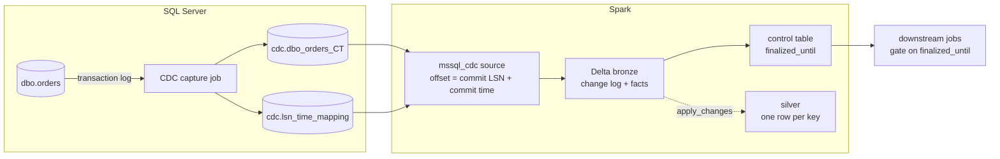

# mssql-cdc-pyspark

A PySpark streaming source for SQL Server Change Data Capture (CDC), a Delta sink with
per-batch facts, and a completeness signal, `finalized_until`, that tells downstream jobs
when a period of data is safe to read. Pure Python on Spark's DataSource V2 API: no JVM
connector and no platform-specific APIs. Tested on local Spark 4.2, on a local
[Spark Connect](getting-started/installation.md#spark-connect) server and on Databricks
classic compute (DBR 18.2, single node); other Spark 4.2+ runtimes and multi-node clusters
are untested. Databricks serverless runs it through Spark Connect, with `availableNow`
only ([Databricks](DATABRICKS.md)). The metrics need
[metricsPath](reference/options.md#metricspath) on a local or FUSE path every node sees, or
on a URI `pyarrow.fs` opens (`s3://`, `abfss://`...).

!!! warning "Experimental"
    The streaming engine is covered by unit tests and the SQL Server behaviour by
    integration tests against SQL Server 2022. Within 0.x a minor release may change the
    Python API; the state a stream leaves behind (checkpoints, table schemas) never breaks
    without a migration path ([ADR 0021](decisions/0021-compatibility-policy-for-0x.md)).

!!! note "These pages document `main`"
    The latest release on PyPI may be older: the
    [changelog](https://github.com/emanuel-luis/mssql-cdc-pyspark/blob/main/CHANGELOG.md)
    says what each release has. A release candidate installs only with
    `pip install --pre mssql-cdc-pyspark` or its exact pin, such as
    `mssql-cdc-pyspark==0.5.0`. Versioned docs come later.

## The problem

With CDC, "the hour has data" no longer means "the hour is complete": a commit can reach
the lake after its hour has passed, and a job that reads 14:00 at 15:05 may read it
incomplete. Watermarks inferred from the event times a pipeline has seen are a heuristic:
they cannot account for records not seen yet, and they stall on an idle table.

SQL Server already knows. The capture process writes changes in commit order,
`sys.fn_cdc_get_max_lsn()` is the last commit it has processed, and on an idle database it
keeps writing entries so that LSN keeps moving. This library carries that frontier from the
source to the consumer. The reasoning is in [Design notes](DESIGN.md).

## What it does

- Streams the change table of a capture instance into Spark, with offsets that are commit
  LSNs: every micro-batch is a prefix of the source's commit history and ends on a commit.
- Writes the changes to a Delta bronze table idempotently, with one facts row per
  micro-batch (counts, LSN range, lag, retention headroom, network metrics).
- Loads the whole table once with a snapshot taken at a recorded LSN, so the target holds
  more than what CDC retention still has.
- Fails loudly when CDC cleanup purged changes the stream still needed, or re-snapshots on
  its own and records the gap.
- Advances `finalized_until` per table, only after the data is committed, never backwards.
- Optionally keeps a current-state (silver) table, one row per key, from the change log.

## The pipeline at a glance



In code, one stream and one verdict:

```python
from mssql_cdc import finalization, stream

options = {
    "connectionString": "Server=host,1433;Database=db;UID=u;PWD=p;Encrypt=yes",
    "captureInstance": "dbo_orders",
}
query = stream(spark, options).to_delta(
    "bronze.orders",
    app_id="orders-v1",
    checkpoint="/checkpoints/orders",
    facts_table="ops.ingestion_facts",
    trigger={"availableNow": True},
    bootstrap=True,
)
query.awaitTermination()

end = finalization.end_offset_from_progress(query.lastProgress)
finalization.advance(spark, "ops.table_finalization", "bronze.orders", end)
```

## Where to go next

- Getting started: [Installation](getting-started/installation.md) for the package, the
  driver and Spark; [Quickstart](getting-started/quickstart.md) for a first stream against
  a local SQL Server in Docker.
- Running a stream: [Streaming into Delta](guides/streaming.md) (options, triggers,
  checkpoints, `app_id`), [Bootstrap](guides/bootstrap.md) (the initial load) and
  [Data loss and re-snapshots](guides/data-loss.md) (when CDC cleanup wins the race).
- Downstream: [Silver tables](guides/silver.md) (`apply_changes`) and
  [Finalization](guides/finalization.md) (gating consumers on `finalized_until`).
- Operations: [Monitoring](guides/monitoring.md) (the facts table and alert queries),
  [Permissions](guides/permissions.md) (a least-privilege login),
  [Schema changes](guides/schema-changes.md) (DDL and capture instance switches) and
  [Databricks](DATABRICKS.md).
- Reference: [Options](reference/options.md), [Output schema](reference/output-schema.md),
  [Tables](reference/tables.md) and the [Python API](reference/api.md).
